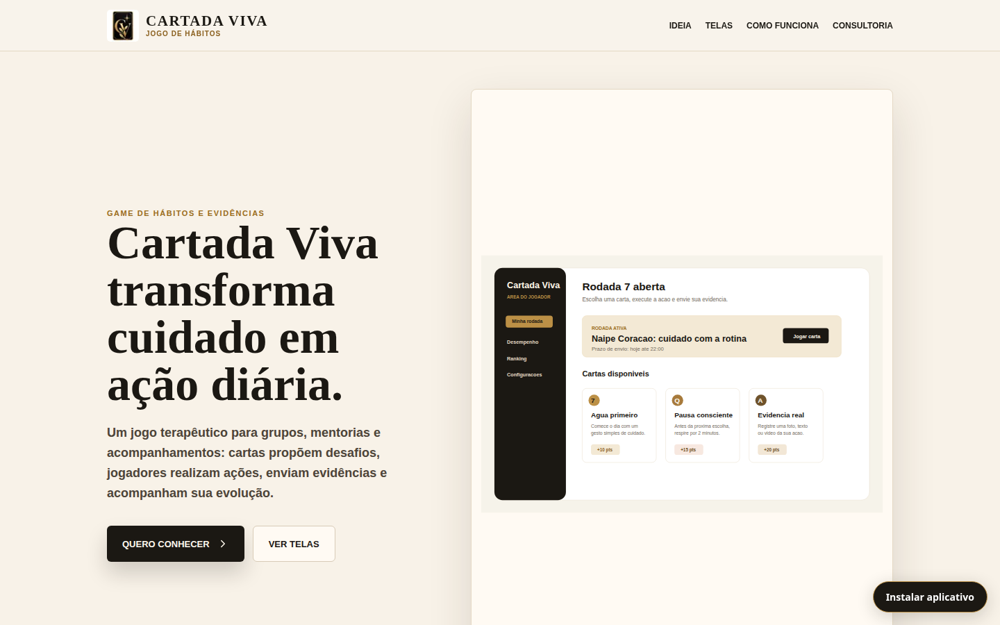
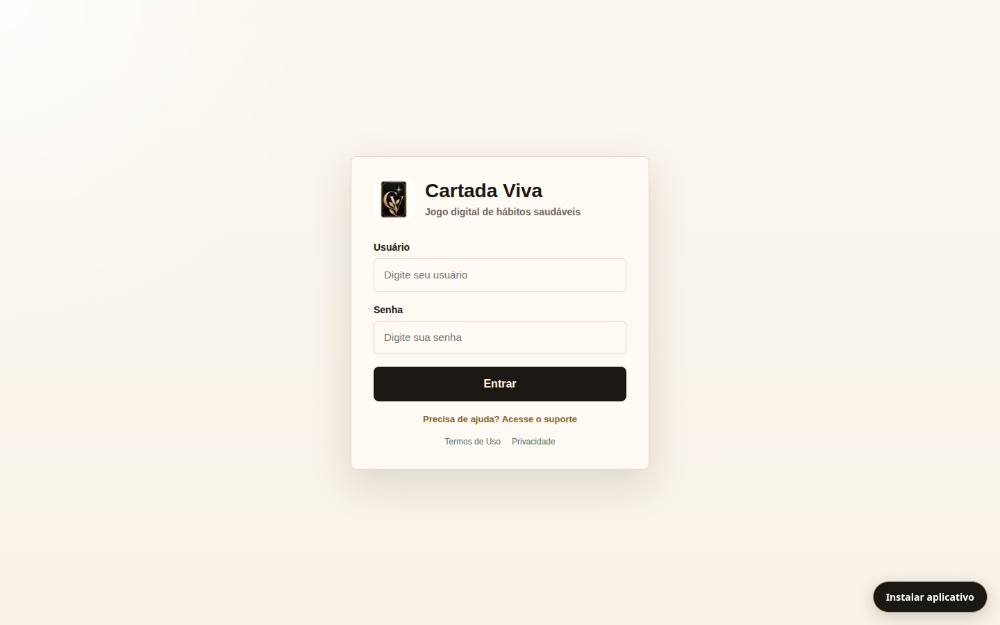

# Cartada Viva · A Última Cartada

Plataforma web para conduzir um jogo terapêutico de hábitos em grupos, com cartas, rodadas, evidências, pontuação e acompanhamento. Reúne também comunidade, jornadas, desafios-relâmpago, mentoria e suporte em uma única experiência para participantes e equipe.

> O sistema organiza a participação e o acompanhamento; não substitui atendimento, diagnóstico ou tratamento por profissionais de saúde.

## Visão do sistema

As imagens abaixo foram atualizadas após a adoção da identidade Cartada Viva em preto, dourado e branco e capturadas do frontend em execução. A tela “Cartada Viva” é uma **prévia pública** da proposta do jogo; áreas administrativas e de jogadores exigem autenticação e não estão representadas por dados fictícios nestas capturas.

| Apresentação | Prévia pública do jogo |
| --- | --- |
| [](docs/screenshots/landing.png) | [](docs/screenshots/cartada-viva.png) |

| Tutorial de cadastro | Acesso à plataforma |
| --- | --- |
| [](docs/screenshots/herbalife.png) | [](docs/screenshots/login.png) |

## Funcionalidades

- **Jogo e jornadas:** grupos, jogos, rodadas, cartas, jogadas, jornadas e desafios-relâmpago agendados.
- **Evidências e pontuação:** envio com prazo, revisão administrativa, ranking e acompanhamento de desempenho.
- **Comunidade:** timeline por grupo, reações, comentários e ranking na experiência do jogador.
- **Mentoria:** acesso por produto contratado, programas, módulos e conteúdos em vídeo ou documento publicados pela equipe.
- **Gestão:** relatórios, auditoria, notificações e chamados de suporte com histórico.
- **Acesso e transparência:** autenticação JWT, papéis de usuário, tour de primeiro acesso, documentos legais versionados e PWA instalável.

Os textos padrão de Termos de Uso e Privacidade são **minutas não publicadas**. Precisam ser completados e revisados antes da publicação em `/admin/legal`; consulte [LEGAL_CONTENT_REVIEW.md](LEGAL_CONTENT_REVIEW.md). O tutorial Herbalife também depende da validação do fluxo comercial real: [HERBALIFE_CONTENT_REVIEW.md](HERBALIFE_CONTENT_REVIEW.md).

## Stack e estrutura

| Camada | Tecnologia |
| --- | --- |
| Backend | Python, Django, Django REST Framework, Simple JWT |
| Banco | PostgreSQL |
| Frontend | Next.js App Router, React, TypeScript, CSS Modules, Axios |
| Produção prevista | Gunicorn, Nginx, serviços systemd, HTTPS |

```text
backend/
  apps/              # domínio, APIs, serviços, permissões e testes
  config/            # configuração e rotas Django
  manage.py
frontend/
  src/app/           # rotas públicas, admin e jogador
  src/components/    # layouts e componentes compartilhados
  src/services/      # acesso à API
  public/            # assets e service worker
docs/                # guias e capturas de tela
```

O frontend consome a API por `frontend/src/lib/api.ts`. O Django Admin usa `/django-admin/` para não conflitar com o painel Next.js em `/admin/...`.

## Executar localmente

Requisitos: Python, Node.js 20 ou 22 e PostgreSQL. Os comandos abaixo partem da raiz do repositório.

1. Crie o banco PostgreSQL e um usuário com permissões para aplicar as migrações.
2. Copie `backend/.env.example` para `backend/.env` e preencha `SECRET_KEY`, `DB_*`, hosts e origens locais. Não versione o arquivo.
3. Prepare e inicie o backend:

```bash
cd backend
python3 -m venv .venv
source .venv/bin/activate
pip install -r requirements.txt
python manage.py migrate
python manage.py runserver
```

4. Em outro terminal, prepare e inicie o frontend:

```bash
cd frontend
npm ci
```

Copie `frontend/.env.example` para `frontend/.env.local` e defina `NEXT_PUBLIC_API_URL=http://127.0.0.1:8000/api/v1` ao usar os servidores locais separadamente. Depois execute:

```bash
npm run dev
```

Acesse `http://localhost:3000`; a API local fica em `http://127.0.0.1:8000/api/v1/`. Em produção, `NEXT_PUBLIC_API_URL=/api/v1` funciona com o proxy Nginx descrito em [DEPLOYMENT.md](DEPLOYMENT.md).

### Dados de demonstração

Em um **banco exclusivamente de desenvolvimento**, após as migrações, execute `python manage.py seed_demo` dentro de `backend/`. O comando cria/atualiza contas de exemplo, cartas, grupo, jogo e rodadas e imprime as credenciais no terminal. Não o execute em produção: ele usa uma senha de demonstração conhecida e altera registros existentes com os mesmos nomes.

## Rotas principais

| Área | Rotas |
| --- | --- |
| Públicas | `/`, `/public/cartada-viva`, `/public/consultoria`, `/public/herbilife`, `/terms`, `/privacy` |
| Entrada | `/login`, `/dashboard` |
| Jogador | `/player/home`, `/player/community`, `/player/performance`, `/player/ranking`, `/mentorship`, `/player/support` |
| Administração | `/admin/dashboard`, `/admin/players`, `/admin/groups`, `/admin/games`, `/admin/journeys`, `/admin/challenges`, `/admin/mentorship`, `/admin/support`, `/admin/legal`, `/admin/audit`, `/admin/reports` |
| API e Django Admin | `/api/v1/`, `/django-admin/` |

O acesso às rotas protegidas depende do papel (`DEV`, `GENERAL_ADMIN`, `GAME_MEDIATOR` ou `PLAYER`) e dos produtos concedidos à conta. As APIs devem filtrar dados de participantes por usuário e grupo.

## Validação e documentação

```bash
cd backend
source .venv/bin/activate
python manage.py check
python manage.py test

cd ../frontend
npm run lint
npm run build
```

O PWA deve ser conferido em HTTPS ou `localhost`; veja [PWA_TESTING.md](PWA_TESTING.md). Para ambiente local e deploy, consulte [docs/LOCAL_DEVELOPMENT.md](docs/LOCAL_DEVELOPMENT.md) e [DEPLOYMENT.md](DEPLOYMENT.md). O roteiro de evolução está em [PLANO_IMPLEMENTACAO_NOVOS_REQUISITOS.md](PLANO_IMPLEMENTACAO_NOVOS_REQUISITOS.md).

Não versione `.env`, bancos locais, uploads, `.venv/`, `node_modules/` ou `.next/`. Evidências e dados de saúde ou participação devem ser tratados conforme as permissões e a política de privacidade efetivamente publicada.
